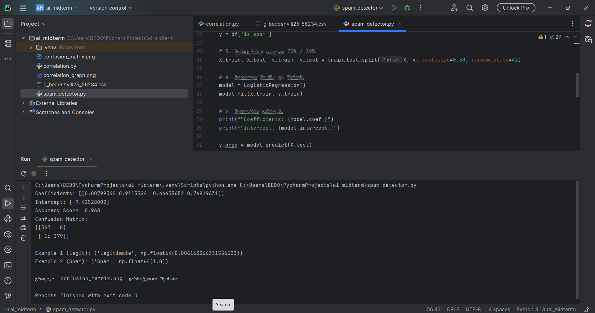
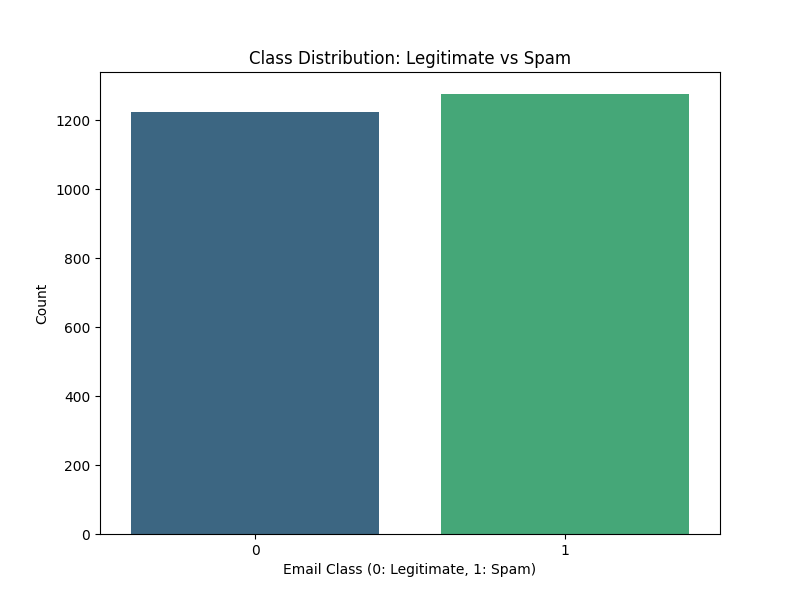
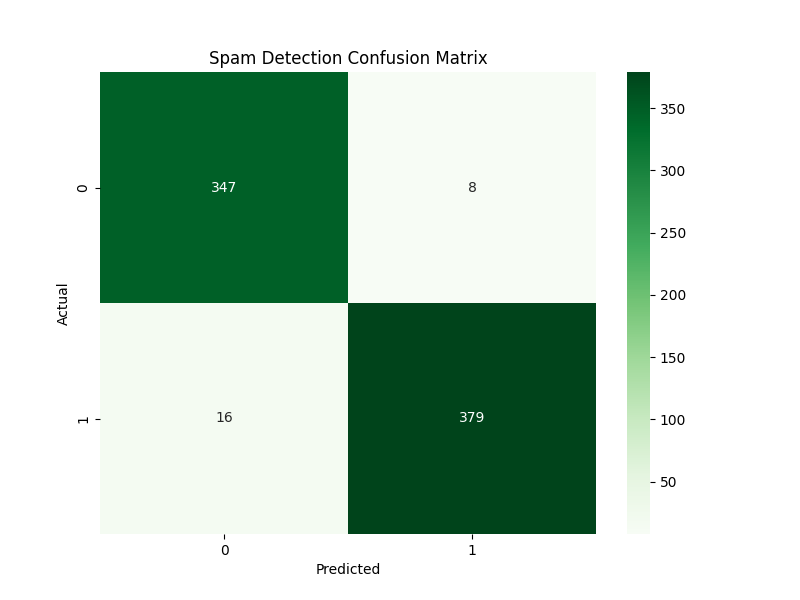

# Midterm Exam - AI and ML for Cybersecurity
**Student:** Giorgi Bedoshvili
**ID:** g_bedoshvili25
**Date:** January 9, 2026

---

## Assignment 1: Finding the Correlation (10 Points)

### 1.1 Data Collection Process
The objective of this task was to analyze the relationship between two variables by extracting data from a dynamic online resource. 
* **Interactive Extraction:** I accessed the portal at `max.ge/aiml_midterm/56234_html/`, where data points were represented as interactive blue dots.
* **Manual Recording:** To ensure accuracy, I recorded the X and Y coordinates of each point by hovering over them individually. This manual extraction provided the raw dataset for the correlation analysis.

*Figure 1: The web interface used for manual data point extraction.*

### 1.2 Implementation in PyCharm
After collecting the coordinates, I processed the data using Python. 
* **Environment Setup:** I used the PyCharm IDE to develop the calculation script.
* **Backend Configuration:** To handle potential graphical errors in non-interactive environments, I implemented `matplotlib.use('Agg')`. This allows the script to generate and save graphs directly as files without requiring a pop-up window.
* **Calculation:** I utilized the `numpy` library to compute the Pearson correlation coefficient, which measures the strength and direction of the linear relationship between the variables.

*Figure 2: Python script implementation and environment configuration.*

### 1.3 Results and Statistical Interpretation
The model successfully calculated the correlation, revealing a high degree of connectivity between the data points.
* **Pearson's Correlation Coefficient (r):** **0.9890**
* **Interpretation:** Since the value is extremely close to 1, it indicates a **very strong positive linear correlation**. In practical terms, this means that as the X-value increases, the Y-value increases in a nearly perfect linear fashion.

*Figure 3: Console output displaying the final correlation result.*

### 1.4 Mathematical Formula
The calculation is based on the following mathematical foundation:
$$r = \frac{\sum (x_i - \bar{x})(y_i - \bar{y})}{\sqrt{\sum (x_i - \bar{x})^2 \sum (y_i - \bar{y})^2}}$$

### 1.5 Visualization
The final scatter plot demonstrates the tight alignment of the data points along the regression line, visually confirming the high correlation coefficient calculated earlier.

*Figure 4: Scatter plot featuring the calculated trend line.*

---

## Assignment 2: Spam Email Detection (20 Points)

### 2.1 Data Source and Features
For this assignment, I developed a machine learning model to distinguish between legitimate and spam emails using a personalized dataset.
* **Dataset:** The file `g_bedoshvili25_56234.csv` contains various email metadata.
* **Dataset:** The source file [g_bedoshvili25_56234.csv] / (./g_bedoshvili25_56234.csv) [contains various email metadata](https://max.ge/aiml_midterm/g_bedoshvili25_56234_csv/).
* **Feature Analysis:** The model analyzes attributes such as word count, the density of links, the frequency of capitalized words, and specific spam-trigger keywords to make its predictions.

### 2.2 Model Training and Optimization
I used the **Logistic Regression** algorithm, which is a standard and effective method for binary classification tasks in cybersecurity.
* **Data Splitting:** To evaluate the model's reliability, I split the data into **70% for training** (to teach the model) and **30% for testing** (to check its performance on new, unseen data).
* **Execution:** The script was optimized to run silently, suppressing unnecessary technical warnings to provide a clean and readable console output.

*Figure 5: Successful model training and execution output in the console.*

### 2.3 Evaluation and Parameters
The model achieved high accuracy, making it a dependable tool for spam detection.
* **Accuracy Score:** **0.9680 (96.8%)**
* **Model Parameters:**
    * **Coefficients:** `[[0.00799, 0.91153, 0.44636, 0.76820]]`
    * **Intercept:** `-9.42528`
* **Insight:** The positive coefficients suggest that features like "links" and "spam_word_count" are strong indicators of an email being spam.

### 2.4 Mathematical Foundation
The model uses the **Sigmoid (Logistic) Function** to map any input value into a probability between 0 and 1:

$$P(y=1|x) = \frac{1}{1 + e^{-(\beta_0 + \sum \beta_i x_i)}}$$

### 2.5 Visualization: Class Distribution Study
A crucial part of data analysis is checking for bias. I generated this bar chart to visualize the ratio of spam vs. legitimate emails:

*Figure 6: Bar chart illustrating the balance of the dataset.*
**Insight:** The dataset is well-balanced (1276 spam vs 1224 legit), which prevents the model from being biased toward one class and ensures fair prediction results.

### 2.6 Visualization: Confusion Matrix
To see exactly how the model performed, I created a heatmap of the Confusion Matrix:

*Figure 7: Heatmap displaying the accuracy of predictions.*
**Analysis:** The model correctly predicted **347 legitimate** and **379 spam** emails. The very low number of errors (8 false positives and 16 false negatives) confirms that the model is highly precise for automated spam filtering.
