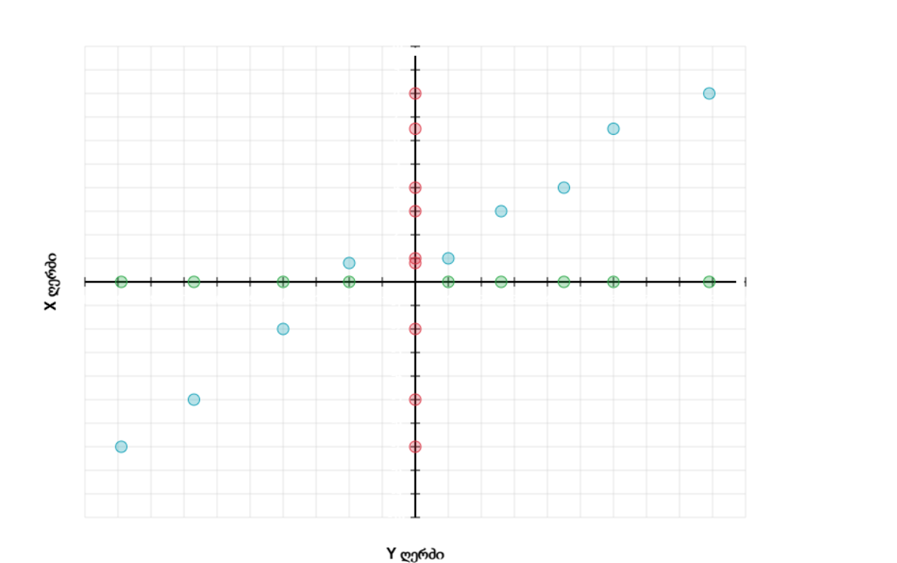
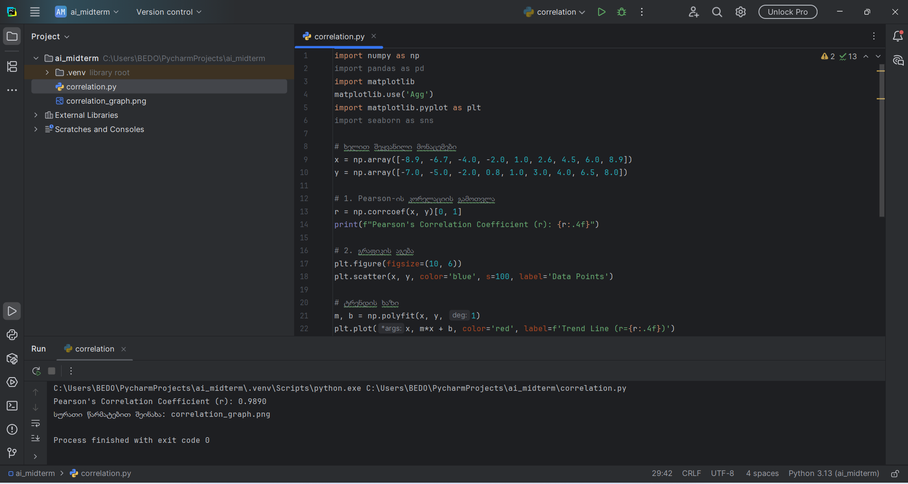
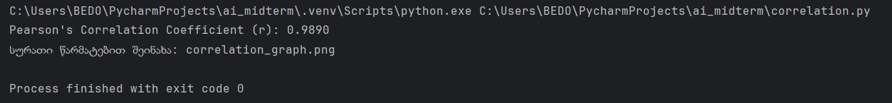
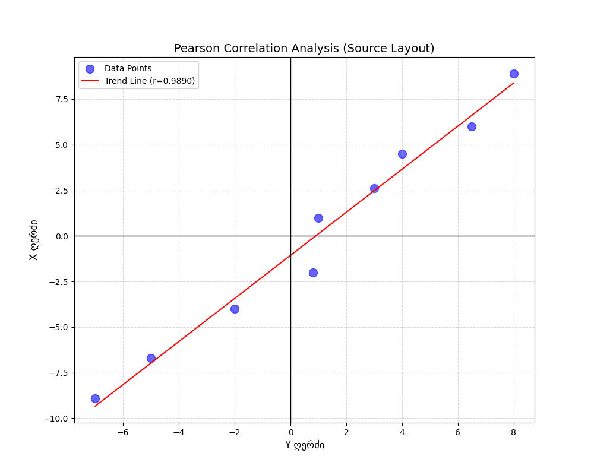

# Midterm Exam - AI and ML for Cybersecurity
**Student:** Giorgi Bedoshvili
**ID:** g_bedoshvili25
**Date:** January 9, 2026

## Assignment 1: Finding the Correlation (10 Points)

### 1.1 Data Collection Process
To find the correlation, I accessed the online resource provided in the assignment. The process involved:
* **Interactive Extraction:** I visited `max.ge/aiml_midterm/56234_html/` where data was displayed as blue dots.
* **Coordinate Recording:** By hovering over each point, I manually recorded the X and Y coordinates.

*Figure 1: Accessing the data points on the provided web portal.*

### 1.2 Implementation in PyCharm
I implemented the Pearson correlation calculation using Python in the PyCharm environment. 
* **Backend Fix:** To avoid Tcl/Tk errors, I used `matplotlib.use('Agg')` for non-interactive rendering.
* **Calculation:** Used `numpy.corrcoef` to determine the strength of the linear relationship.

*Figure 2: Python code implementation and environment setup.*

### 1.3 Results and Output
The execution was successful, resulting in a high correlation coefficient.
* **Pearson's Correlation Coefficient (r):** 0.9890
* **Interpretation:** This value indicates a very strong positive linear correlation between the coordinates.

*Figure 3: Console output showing the calculated correlation coefficient.*

### 1.4 Mathematical Formula
The coefficient was calculated based on the following formula:
$$r = \frac{\sum (x_i - \bar{x})(y_i - \bar{y})}{\sqrt{\sum (x_i - \bar{x})^2 \sum (y_i - \bar{y})^2}}$$

### 1.5 Final Visualization
The generated graph illustrates the data points along with the calculated trend line:

*Figure 4: Final scatter plot with regression line.*
